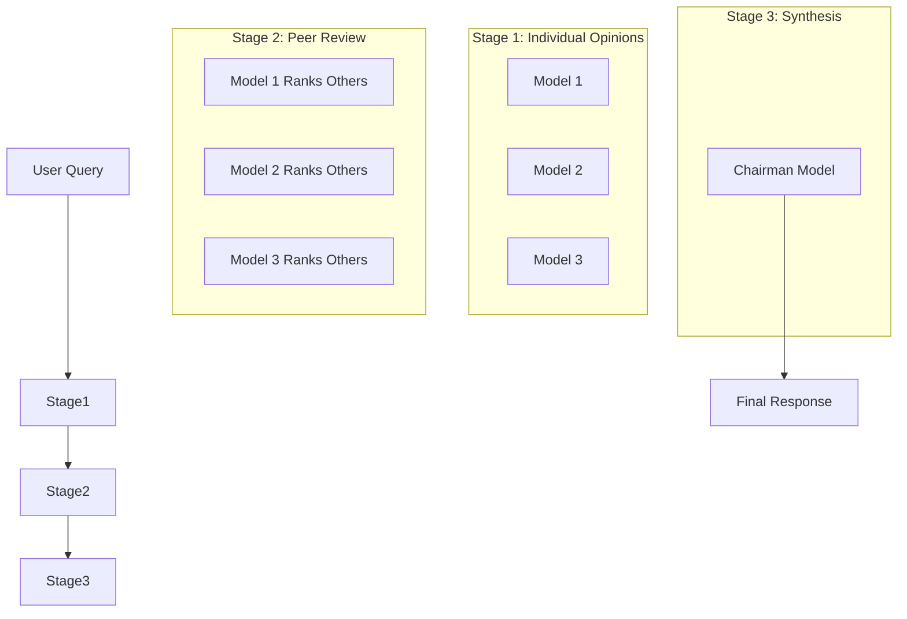

# AI Architecture & OpenRouter Integration

This document explains the AI architecture of the LLM Council project and how it integrates with OpenRouter.

## Overview

LLM Council orchestrates a "council" of multiple Large Language Models (LLMs) to answer user queries. Instead of relying on a single model, it leverages the diversity of multiple top-tier models to provide a more comprehensive and verified answer.

The core process consists of 3 stages:
1.  **Individual Opinions**: All models answer the query independently.
2.  **Peer Review**: Models review and rank each other's anonymized answers.
3.  **Chairman Synthesis**: A designated "Chairman" model synthesizes a final answer based on all opinions and rankings.

## OpenRouter Integration

The project uses [OpenRouter](https://openrouter.ai/) as a unified API gateway to access various LLMs (OpenAI, Anthropic, Google, etc.) through a single interface.

### Implementation Details

The integration is handled in `backend/openrouter.py`.

*   **Client**: Uses `httpx.AsyncClient` for asynchronous HTTP requests.
*   **Endpoint**: `https://openrouter.ai/api/v1/chat/completions`
*   **Authentication**: Uses a Bearer token (`OPENROUTER_API_KEY`) from environment variables.
*   **Request Format**: Standard OpenAI-compatible Chat Completion API format.

```python
# Simplified request structure
headers = {
    "Authorization": f"Bearer {OPENROUTER_API_KEY}",
    "Content-Type": "application/json",
}

payload = {
    "model": "provider/model-name",
    "messages": [{"role": "user", "content": "..."}]
}
```

### Parallel Execution

To ensure low latency, the backend queries all models in parallel using `asyncio.gather`. This is defined in `query_models_parallel` in `backend/openrouter.py`.

## The Council Process (3 Stages)

The orchestration logic resides in `backend/council.py`.

### Stage 1: Individual Responses
*   **Function**: `stage1_collect_responses`
*   **Action**: The user's query is sent to all models defined in `COUNCIL_MODELS` (in `config.py`) simultaneously.
*   **Output**: A list of responses from each model.

### Stage 2: Peer Review & Ranking
*   **Function**: `stage2_collect_rankings`
*   **Anonymization**: Responses from Stage 1 are assigned labels (Response A, Response B, etc.) to prevent bias.
*   **Action**: Each model is presented with the original question and the anonymized responses of its peers. It is asked to:
    1.  Critique each response.
    2.  Provide a **FINAL RANKING** of the responses from best to worst.
*   **Parsing**: The backend parses the text response to extract the structured ranking.

### Stage 3: Chairman Synthesis
*   **Function**: `stage3_synthesize_final`
*   **Action**: The "Chairman" model (defined in `CHAIRMAN_MODEL`) receives:
    *   The original question.
    *   All individual responses (Stage 1).
    *   All peer reviews and rankings (Stage 2).
*   **Goal**: The Chairman synthesizes this information into a single, high-quality answer that incorporates the best insights from the council and resolves any disagreements.

## Configuration

Model selection is configured in `backend/config.py`:

*   `COUNCIL_MODELS`: List of models that participate in the council.
*   `CHAIRMAN_MODEL`: The model responsible for the final synthesis.

## Diagram


